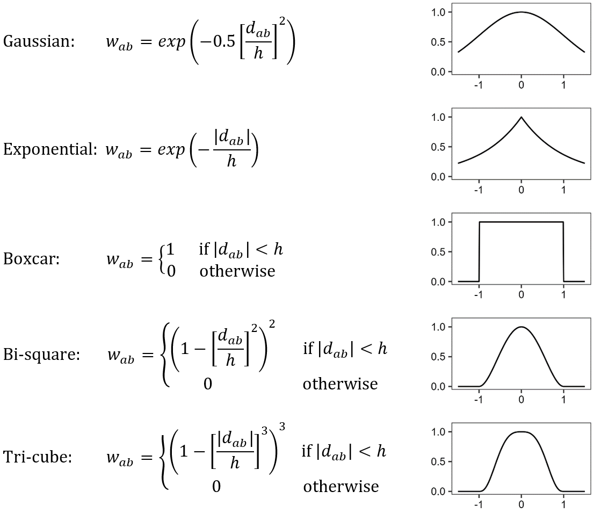

```{r echo = F, cache = F}
suppressMessages(library(knitr))
suppressMessages(library(here))
suppressMessages(library(officedown))
suppressMessages(library(officer))

opts_chunk$set(
  fig.align = "center",
  fig.retina = 5,
  warning = F,
  message = F,
  cache = F,
  echo = F,
  fig.cap = TRUE
)
```

```{r}
#--- packages ---#
library(data.table)
library(tidyverse)
library(flextable)
library(stringr)
library(sf)
library(lfe)
library(modelsummary)
library(patchwork)
library(ggplot2)
```

```{r figure_setup}
theme_update(
  axis.title.x =
    element_text(
      size = 12, angle = 0, hjust = .5, vjust = -0.3, family = "Times"
    ),
  axis.title.y =
    element_text(
      size = 12, angle = 90, hjust = .5, vjust = .9, family = "Times"
    ),
  axis.text.x =
    element_text(
      size = 10, angle = 0, hjust = .5, vjust = 1.5, family = "Times"
    ),
  axis.text.y =
    element_text(
      size = 10, angle = 0, hjust = 1, vjust = 0, family = "Times"
    ),
  axis.ticks =
    element_line(
      size = 0.3, linetype = "solid"
    ),
  axis.ticks.length = unit(.15, "cm"),
  #--- legend ---#
  legend.text =
    element_text(
      size = 10, angle = 0, hjust = 0, vjust = 0, family = "Times"
    ),
  legend.title =
    element_text(
      size = 10, angle = 0, hjust = 0, vjust = 0, family = "Times"
    ),
  legend.key.size = unit(0.5, "cm"),
  #--- strip (for faceting) ---#
  strip.text = element_text(size = 10),
  #--- plot title ---#
  plot.title = element_text(family = "Times", face = "bold", size = 12),
  #--- margin ---#
  # plot.margin = margin(0, 0, 0, 0, "cm"),
  #--- panel ---#
  panel.grid.major = element_blank(),
  panel.grid.minor = element_blank(),
  panel.background = element_blank(),
  panel.border = element_rect(fill = NA)
)
```

```{r include = FALSE}
kernel_ls <- c("gaussian", "bisquare", "exponential", "tricube", "boxcar")

gg_appendix <-
  data.frame(kernel = kernel_ls) %>%
  rowwise() %>%
  mutate(results = list(
    here("Shared", "Results", kernel, "pi_data.rds") %>%
      readRDS() %>%
      .[, type := ifelse(transfer == 0, "GWRR", "GWRT")] %>%
      .[, bias := pi_diff_est - pi_diff] %>%
      # only display the 25% (5.44), 50% (6.56), 75% (7.67) price ratio
      .[pRatio %in% c(5.44, 6.56, 7.67), ] %>%
      # === label price ratio
      .[, pLabelName := "Price Ratio (N/corn)"] %>%
      .[pRatio == 5.44, pLabel := "Low"] %>%
      .[pRatio == 6.56, pLabel := "Middle"] %>%
      .[pRatio == 7.67, pLabel := "High"] %>%
      .[, pLabel := factor(pLabel, levels = c("Low", "Middle", "High"))]
  )) %>%
  #* ===========================================================
  #* Plots of the value of GWR
  #* ===========================================================
  mutate(median_data_value = list(
    results %>%
      .[, .(pi_diff = median(pi_diff)),
        by = c("field_col", "pLabel", "type")
      ]
  )) %>%
  mutate(g_value = list(
    results %>%
      ggplot(data = .) +
      geom_histogram(
        aes(x = pi_diff),
        fill = NA,
        color = "blue",
        bins = 50,
        size = 0.2
      ) +
      geom_vline(
        data = median_data_value,
        aes(xintercept = pi_diff),
        color = "red",
        size = 0.5
      ) +
      geom_text(
        data = median_data_value, color = "red",
        aes(
          x = ifelse(pi_diff < 65, pi_diff + 5, pi_diff - 20),
          y = 150,
          label = paste0("Median = ", round(pi_diff, 2))
        ),
        angle = 0, hjust = -0.1, vjust = 0, size = 3
      ) +
      facet_grid(pLabel ~ type) +
      scale_y_continuous(expand = c(0, 0), limits = c(NA, 200)) +
      scale_x_continuous(breaks = 20 * (-2:3), limits = c(-45, 60)) +
      xlab("The value of VRA over URA ($ per ha)") +
      ylab("Number of Simulation Cases")
  )) %>%
  #* ===========================================================
  #* Plots of the bias in the value of GWR
  #* ===========================================================
  mutate(median_bias_data = list(
    results %>%
      .[, bias := pi_diff_est - pi_diff] %>%
      .[, .(bias = median(bias)),
        by = c("field_col", "pLabel", "type")
      ]
  )) %>%
  mutate(g_bias = list(
    results %>%
      .[, bias := pi_diff_est - pi_diff] %>%
      .[bias < 150, ] %>%
      ggplot(data = .) +
      geom_histogram(
        aes(x = bias),
        fill = NA,
        color = "blue",
        size = 0.2,
        bins = 50
      ) +
      geom_vline(
        data = median_bias_data, aes(xintercept = bias),
        color = "red",
        size = 0.5
      ) +
      geom_text(
        data = median_bias_data, color = "red",
        aes(
          x = ifelse(bias < 65, bias + 2, bias - 85), y = 100,
          label = paste0("Median = ", round(bias, 2))
        ),
        angle = 0, hjust = -0.1, vjust = 0, size = 3
      ) +
      facet_grid(pLabel ~ type) +
      scale_y_continuous(expand = c(0, 0)) +
      xlab("Bias in the Estimation of the Value of VRA over URA ($ per ha)") +
      ylab("Number of Simulation Cases")
  )) %>%
  select(kernel, g_value, g_bias)
```

# Appendix: Results with Alternative Kernel Functions {-}

There are many different kernel functions to define the distance-decay weightings for GWR model. In the main text, the Gaussian kernel function was use, which can be mathematically represented as follows:

\begin{equation}
w_{ab}=exp⁡(-0.5[\frac{d_{ab}}{h}]^2 ),
(\#eq:q)
\end{equation}

where $d_{ab}$ denotes the Euclidean distance between observation $b$ and regression location $a$, $w_{ab}$ denotes the kernel weight assigned to observation $b$, and $h$ denotes the bandwidth. 

This appendix compares several other alternative kernel functions, including the Exponential, Boxcar, Bi-square, and Tri-cube, in additional to the Gaussian. The functional forms and graphical representations of these kernels can be found in Figure A\@ref(fig:kernel). The estimation results obtained using alternative kernel functions, apart from the Gaussian kernel, are presented in Figures A\@ref(fig:value-kernel-bs) through A\@ref(fig:bias-kernel-boxcar). 

```{r, fig.id = "kernel", fig.cap = "List of Kernel functions"}

```

For the case of Exponential kernel, which is a continuous kernel like the Gaussian, the optimal bandwidth selection follows a similar corrected AIC approach and results in a similar bandwidth of 18 meters. For the discontinuous kernels of Boxcar, Bi-square, and Tri-cube, however, the 18-meter bandwidth does not encompass a sufficient number of neighboring observations for reliable local regressions, resulting in unrealistic estimation outcomes. To address this issue, an empirical bandwidth of 100 meters is chosen for these discontinuous kernels to enable the inclusion of an adequate number of local observations. Other bandwidth values (such as 80 meters, 150 meters) are also conducted and the resulting estimation outcomes are found to be comparable. 

Overall, the economic evaluation results of GWR models presented in this study are not significantly influenced by the selection of the kernel function in GWR estimation. Despite slight variations in calculated profit and bias among the different kernels, the qualitative consistency of the final conclusions remains intact regardless of the chosen kernel.

## Comparing the values of GWR-based VRA and SCAM-based URA {-}

Figures A\@ref(fig:value-kernel-bs) through A\@ref(fig:value-kernel-boxcar) show the distribution of the true economic value of GWR using four different kernels: Bi-square, Exponential, Tri-cube, and Boxcar.

\begin{equation}
\Delta^{GWR}=\Pi^{GWR}-\Pi^{SCAM}
(\#eq:label)
\end{equation}

Using the Gaussian kernel, we found that GWRR performs better as the price ratio increases, and GWRT performs better as the price ratio decreases (see Figure 3 of the main text). This holds true across all the other kernel function choices. Although there are some variations in the magnitudes of $\Delta^{GWR}$ among different kernel function choices, these differences do not significantly affect the conclusions drawn in the main text.

```{r, fig.id = "value-kernel-bs", fig.cap = "The value of GWR-based VRA over SCAM-based URA for GWRR and GWRT using the Bi-square kernel", fig.height = 3.5}
gg_appendix$g_value[[2]]
```

```{r, fig.id = "value-kernel-exponential", fig.cap = "The value of GWR-based VRA over SCAM-based URA for GWRR and GWRT using the Exponential kernel", fig.height = 3.5}
gg_appendix$g_value[[3]]
```

```{r, fig.id = "value-kernel-tricube", fig.cap = "The value of GWR-based VRA over SCAM-based URA for GWRR and GWRT using the Tri-cube kernel", fig.height = 3.5}
gg_appendix$g_value[[4]]
```

```{r, fig.id = "value-kernel-boxcar", fig.cap = "The value of GWR-based VRA over SCAM-based URA for GWRR and GWRT using the Boxcar kernel", fig.height = 3.5}
gg_appendix$g_value[[5]]
```

## Bias in the estimation of the value of GWR-based VRA {-}

Figures A\@ref(fig:bias-kernel-bs) through A\@ref(fig:bias-kernel-boxcar) show the distribution of the bias in the estimated economic value of GWR. Similar to the findings from using the Gaussian kernel presnted in Figure 6 under the Gaussian kernel, the GWRR consistently exhibits significant over-estimation of the value of GWR-based VRA across all other kernel function choices. Also, the GWRT demonstrates smaller over-estimation at low price ratios compared to GWRR, while the over-estimation increases as price ratio rises. The presence of a similar fat tail in the GWRT bias distribution is also evident. The magnitudes of the estimation bias vary across kernel function choices, but the differences are not substantial and do not affect qualitatively our conclusions drawn in the main text.

```{r, fig.id = "bias-kernel-bs", fig.cap = "Bias in the estimation of the value of GWR-based VRA over SCAM-based URA for GWRR and GWRT using the Bi-square kernel", fig.height = 3.5}
gg_appendix$g_bias[[2]]
```

```{r, fig.id = "bias-kernel-exponential", fig.cap = "Bias in the estimation of the value of GWR-based VRA over SCAM-based URA for GWRR and GWRT using the Exponential kernel", fig.height = 3.5}
gg_appendix$g_bias[[3]]
```

```{r, fig.id = "bias-kernel-tricube", fig.cap = "Bias in the estimation of the value of GWR-based VRA over SCAM-based URA for GWRR and GWRT using the Tri-cube kernel", fig.height = 3.5}
gg_appendix$g_bias[[4]]
```

```{r, fig.id = "bias-kernel-boxcar", fig.cap = "Bias in the estimation of the value of GWR-based VRA over SCAM-based URA for GWRR and GWRT using the Boxcar kernel", fig.height = 3.5}
gg_appendix$g_bias[[5]]
```